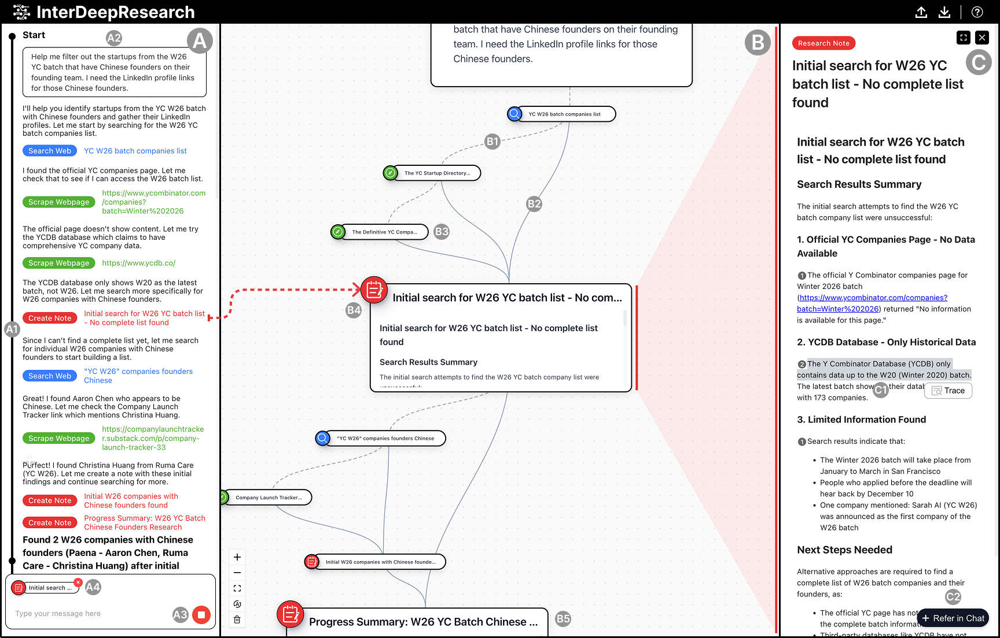
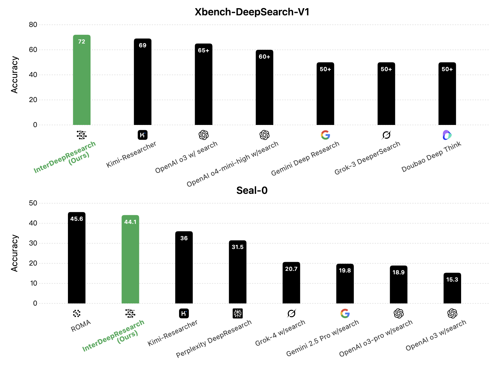

# InterDeepResearch: Enabling Human-Agent Collaborative Information Seeking through Interactive Deep Research

<div align="center">

[](https://www.python.org/downloads/)
[](https://reactjs.org/)
[](https://fastapi.tiangolo.com/)
[](https://socket.io/)

</div>

A prototype interacive research system that enables human-agent collaborative information seeking. Observe, steer, and navigate the research process in real-time with visual sensemaking and evidence tracing.

## System Interface \& Demo

<div align="center">

[](https://replay.dropbox.com/share/qjRvvx5pv8XROENn?video_version_id=pid_rvv%3AAAAAAA-rFZNDtrIrSicdCnrm1NGjCc4ivRWPcR4GA_MfxpAF)

*Click the image above to watch the system demo video*

</div>

## Benchmark Performance
To validate the basic information-seeking capabilities of InterDeepResearch, we evaluate it (without user intervention) on two representative text-based deep research benchmarks: [Xbench-DeepSearch-v1](https://xbench.org/agi/aisearch) and [Seal-0](https://huggingface.co/datasets/vtllms/sealqa). The results demonstrate that InterDeepResearch achieves competitive performance in automated information seeking, even surpassing popular commercial deep research systems like Perplexity Deep Research and Gemini Deep Research.

<div align="center">



</div>

## Getting Started

### Prerequisites

- Python 3.11 or higher
- Node.js 16 or higher
- npm or yarn package manager

### Backend Setup

1. Clone the repository and navigate to the project root:

```bash
git clone https://github.com/bopan3/InterDeepResearch.git
cd InterDeepResearch
```

2. Create and activate a conda environment:

```bash
conda create -n InterDeepResearch python=3.11
conda activate InterDeepResearch
```

3. Install Python dependencies:

```bash
pip install -r requirements.txt
pip install 'crawl4ai[pdf]'
```

4. Install Playwright browsers:

```bash
playwright install
```

5. Configure API keys and settings:

Edit `configs/default_config.yaml` to set up your API keys:

```yaml
# Serper API Key Pool (for web search), you can obtain free key from https://serper.dev/.
SERPER_API_KEY_POOL:
  - "your_serper_api_key_here"

# LLM Configuration. You should use the model name standard vy liteLLM (https://www.litellm.ai/) to specify the model (recommand to use claude-sonnet-4.5 by defualt). 
llm_config:
  agent_config:
    root_agent_config:
      agent_type: "ResearchAgent"
      model: "openrouter/anthropic/claude-sonnet-4.5"
      temperature: 0.2
      top_p: 0.1

# Custom API configuration. You should set up the base_url and api_key from your api platform (recommand to use openrouter for flexibility and stability). 
  customized_base_url: "your_api_base_url"
  customized_api_key: "your_api_key"

# System language: "English" (fixed to English)
system_language: "English"

# Server mode: "normal" (fixed to normal)
server_mode: "normal"
```

6. Start the backend server:

```bash
python IDR_backend/server.py --host 0.0.0.0 --port 5001
```

Optional arguments:
- `--host`: Server host (default: 0.0.0.0)
- `--port`: Server port (default: 5001)
- `--global_config`: Path to config file (default: configs/default_config.yaml)

The backend server will start on `http://localhost:5001`

### Frontend Setup

1. Navigate to the frontend directory:

```bash
cd IDR_frontend
```

2. Install dependencies:

```bash
npm install
```

3. Configure backend connection (if needed):

The frontend connects to `http://localhost:5001` by default. If you changed the backend port, update `IDR_frontend/src/api.tsx`:

```typescript
this.socket = io("http://localhost:5001", {
  // ... connection options
});
```

4. Start the development server:

```bash
npm start
```

The frontend will open automatically at `http://localhost:3000`


## Usage

1. Start the backend server (see Backend Setup step 6)
2. Start the frontend development server (see Frontend Setup step 4)
3. Open your browser and navigate to `http://localhost:3000`
4. Enter your research goal in the input box and start exploring!


